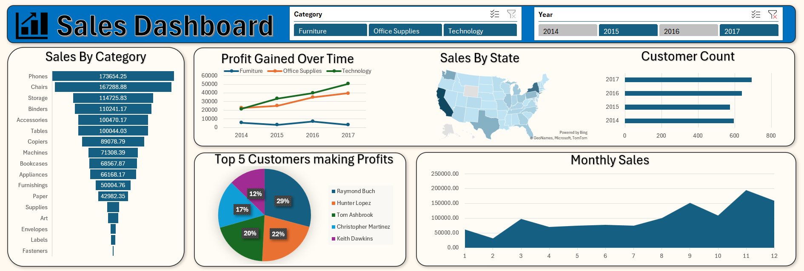

# Excel Sales Dashboard Project

## Project Overview
This project analyzes sales data using **Microsoft Excel** to track business performance across sales, profit, customers, categories, sub-categories, states, and monthly trends.

The final dashboard helps identify profitable products, weak-performing regions, seasonal sales patterns, and business areas that need improvement.

## Business Problem
The business wants to understand why some categories and states generate high sales but low or negative profit.  
The goal is to build an interactive Excel dashboard that helps management monitor sales performance, identify profit gaps, and make better decisions related to pricing, discounts, inventory, and regional strategy.

## Tools Used
- Microsoft Excel
- Pivot Tables
- Pivot Charts
- Slicers
- Data Cleaning
- Dashboard Design
- Business Analysis

## Dataset
- File Name: `salesdata.csv`
- Total Records: `9,994`
- Time Period: `2014 - 2017`
- Total States Covered: `49`

### Key Columns
| Column | Description |
|---|---|
| Order Date | Date of customer order |
| Customer Name | Name of customer |
| State | Customer location |
| Category | Product category |
| Sub-Category | Product sub-category |
| Product Name | Product details |
| Sales | Revenue generated |
| Quantity | Units sold |
| Profit | Profit earned |

## Dashboard Preview

## Key KPIs
| KPI | Value |
|---|---:|
| Total Sales | USD 2.30M |
| Total Profit | USD 286.40K |
| Total Quantity Sold | 37,873 |
| Total Customers | 793 |
| Total States Covered | 49 |

## Dashboard Analysis
The dashboard answers the following business questions:

- Which category generates the highest profit?
- Which states are generating the highest sales?
- Which states are making losses despite high sales?
- Which months have the highest and lowest sales?
- How is the customer base growing year by year?
- Which sub-categories are profitable and which are loss-making?
- Which customers contribute more to business profit?

## Key Insights
- Technology is the most profitable category with around USD 145.46K profit.
- Office Supplies also performs strongly with around USD 122.49K profit.
- Furniture has high sales but very low profit of around USD 18.45K, showing weak margins.
- California and New York are the top-performing states by sales and profit.
- Customer count increased from 595 in 2014 to 693 in 2017, showing positive customer growth.
- Tables, Bookcases, and Supplies are loss-making sub-categories.
- Copiers, Phones, Accessories, Paper, and Binders are among the most profitable sub-categories.

## Business Recommendations
- Focus more on Technology products because they generate the highest profit.
- Review Furniture pricing, discounting, and product cost because sales are high but profit is low.
- Reduce unnecessary discounts in loss-making states and sub-categories.
- Increase marketing campaigns during February to improve low sales performance.
- Give more attention to California and New York because they are strong revenue-generating markets.
- Target high-profit customers with loyalty offers and repeat purchase campaigns.
- Use state-wise and category-wise performance to create better regional sales strategies.

## Skills Demonstrated
- Excel Data Cleaning
- Pivot Table Creation
- Pivot Chart Creation
- KPI Dashboard Design
- Sales Trend Analysis
- Profitability Analysis
- Customer Analysis
- Regional Performance Analysis
- Business Insight Generation

## Conclusion
This Excel Sales Dashboard provides a clear view of overall business performance from 2014 to 2017.  
The analysis shows that Technology is the most profitable category, while Furniture and some sub-categories need margin improvement.  
The dashboard also highlights that some states generate high sales but negative profit, which means the business should review discounting, pricing, and regional sales strategy.  

Overall, this dashboard helps management make data-driven decisions to increase profit, reduce losses, and improve sales performance.
